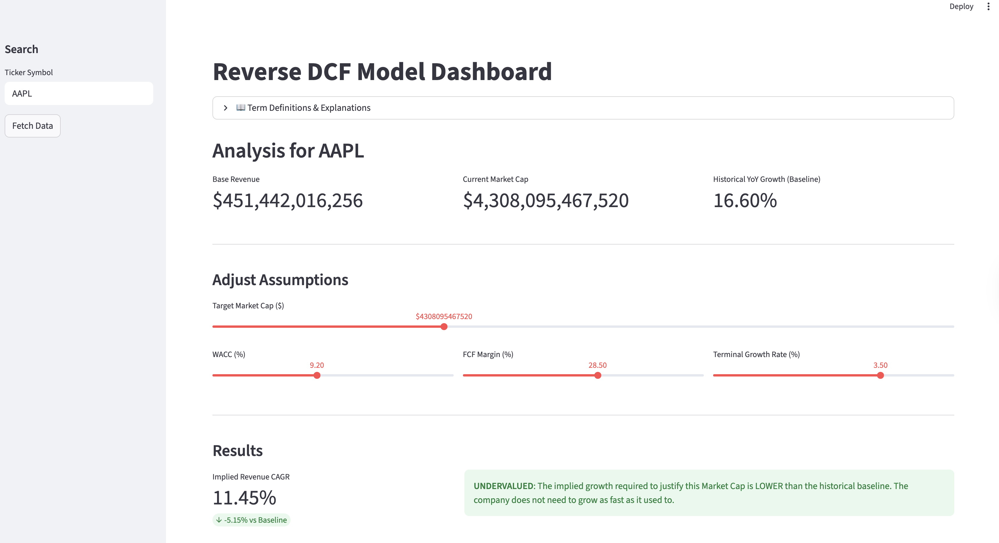

## What is a DCF?

A Discounted Cash Flow (DCF) model is the "gold standard" of valuation. It operates on a simple premise: a company is worth the sum of all the cash it will ever make, brought back into today's dollars. 

To do this, we project Free Cash Flows (FCF) for a decade, add a "Terminal Value" for the years beyond, and apply a **WACC (Weighted Average Cost of Capital)** which is essentially a discount rate that accounts for risk and the time value of money.

## Forward vs. Reverse DCF: Flipping the Script

The difference between these two models is essentially the direction of the math. To understand it, think of a **Road Trip**:

### The Forward DCF (The "Estimated Arrival")
In a standard DCF, you are the driver making guesses about the future.

* **The Inputs:** You decide the speed (Growth Rate) and how much gas you have (Margins).
* **The Output:** The model tells you where you will end up (The Fair Value).
* **The Example:** "If I drive at 60mph for 5 hours, I will be 300 miles away." 
* **The Risk:** If you are too optimistic about your speed, you’ll overestimate how far you’ll get.

Esentially, in a **Forward DCF**, the analyst is the driver. You input your assumptions for growth and margins, and the model outputs a "Fair Value." The danger? Confirmation bias. If you like a stock, you might subconsciously nudge the growth rate higher to justify a "Buy" rating.

### The Reverse DCF (The "Required Speed")
In a Reverse DCF, the destination is already set by the market. We work backward to see if the trip is even possible.

* **The Input:** You start with the destination (The Current Market Cap).
* **The Output:** The model tells you how fast you *must* drive to get there in time (The Implied Growth Rate).
* **The Example:** "The destination is 300 miles away and I only have 3 hours. I **must** drive at 100mph to get there."
* **The Analysis:** You then ask: "Is it realistic to drive 100mph? Does this car even go that fast?" 

Essentially, in a **Reverse DCF** removes the analyst's bias. Instead of guessing a growth rate to find a price, we take the **current Market Cap** as an objective fact and solve for the **Implied Revenue CAGR** (Compound Annual Growth Rate). 

It changes the question from *"What is this stock worth?"* to *"What must the market believe for this price to be right?"*

By flipping the script, we move from **predicting the future** to **auditing the market’s expectations.**

## Project Aim: Quantifying Market Optimism

The goal of this project was to build a production-grade tool that democratizes institutional-level expectations investing. By productionizing this dashboard, I aimed to:

1.  **Isolate the "Expectations Gap":** Compare what the market expects vs. what a company has historically delivered.
2.  **Stress-Test Assumptions:** Visualize how sensitive a valuation is to shifts in macro factors like interest rates (WACC).

## Technical Implementation: Under the Hood

The most challenging part of this project was moving from a static formula to a dynamic **Numerical Solver**. In a standard DCF, you calculate the result directly. In a Reverse DCF, you have to solve for a variable ($g$) that is buried inside a complex series.

### The Optimization Problem
The "Fair Value" ($V$) of a company is the sum of its discounted future cash flows. Our goal is to find the specific growth rate ($g$) that makes this value equal to the current Market Cap ($M$):

$$f(g) = \left( \sum_{t=1}^{10} \frac{FCF_0(1+g)^t}{(1+WACC)^t} + \frac{TV}{(1+WACC)^{10}} \right) - M = 0$$

Since $g$ appears in every term of the 10-year series, we cannot simply use basic algebra to isolate it. Instead, we use **Numerical Root-Finding**.

### The "Hot or Cold" Solver
I implemented the solver using `scipy.optimize.brentq`. Think of this as a highly efficient version of "Goal Seek" in Excel.

1. **The Bracketing:** We tell the computer to look for a growth rate between -50% and +100%.
2. **The Iteration:** The algorithm picks a growth rate, calculates the resulting value, and checks how far it is from the Market Cap. 
3. **The Convergence:** It repeatably narrows the window (using a mix of bisection and inverse quadratic interpolation) until the difference between our calculated value and the market cap is effectively zero.

### Data Architecture
To ensure the model is robust, the pipeline follows a three-stage process:

* **Ingestion:** `yfinance` pulls raw TTM (Trailing Twelve Month) data. 
* **Validation:** The script handles edge cases, such as companies with negative FCF (which would break a standard growth solver).
* **Execution:** The Brent method typically finds the "Implied CAGR" in under 0.01 seconds, allowing for the real-time slider experience in the dashboard.

## How to Use & Interpret the Results

Using the dashboard involves a "Reality Check" workflow:

1.  **Fetch Data:** Input a ticker (e.g., AAPL or MGNI). The tool pulls the baseline revenue and current market price.
2.  **Set the Risk Hurdle:** Adjust the WACC based on the current 10-year Treasury yield and the stock's risk profile.
3.  **Analyze the Implied CAGR:**
    - **Undervalued:** If the Implied CAGR is significantly lower than the historical 5-year average, the market may be too pessimistic.

    - **Overvalued:** If the market expects 20% growth from a company that has matured at 5%, the stock is priced for perfection.

## Future Innovation Axis: From Deterministic to Probabilistic

While the current dashboard provides a "snapshot" of market expectations, the next evolution of this tool involves moving away from static inputs toward dynamic, data-driven simulations.

### 1. Statistical Time Series Forecasting (ARIMA/Prophet)
Currently, our "Baseline" is a simple historical average. We can replace this with **Time Series Modeling** to create a more sophisticated "Expected Growth" benchmark.

* **The Application:** Instead of just comparing the Implied CAGR to last year's growth, we can use an **ARIMA** or **Exponential Smoothing** model to forecast a 3-year revenue trend based on seasonality and momentum.
* **The Value:** If the market's Implied CAGR falls outside the 95% confidence interval of our Time Series forecast, it provides a statistically significant signal of over/undervaluation.

### 2. Stochastic Modeling: Geometric Brownian Motion (GBM)
Stock prices and cash flows don't move in straight lines. We can model the path of a company's valuation as a **Stochastic Process**.

* **The Application:** By treating the company's Free Cash Flow as a variable following **Geometric Brownian Motion (GBM)**, we can account for "random walks" in profitability.
* **The Value:** This allows us to calculate the **Probability of Default** or the likelihood that a company hits its required growth targets given its historical volatility ($\sigma$).

### 3. Monte Carlo Expectation Ensembles
Instead of solving for a single growth rate, we can use **Stochastic Simulations** to vary WACC, Margins, and Terminal Growth simultaneously across thousands of iterations.

* **The Application:** We can assign probability distributions (e.g., a Normal distribution for WACC and a Lognormal distribution for Revenue) and run a Monte Carlo simulation.
* **The Result:** Instead of a single number, the dashboard would produce a **Probability Density Function (PDF)** of the stock’s intrinsic value, showing the most likely "Expectation Range."

---

*This project is a fusion of financial engineering and data science, designed to turn abstract market sentiment into hard, actionable numbers.*