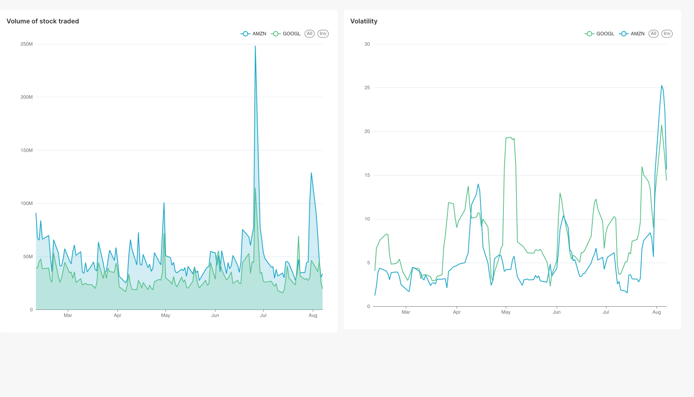

## Introduction

In quantitative finance and data engineering, managing financial datasets requires more than just fetching prices via an API. To build reliable analytical models, you need a robust, production-ready stack that handles scheduled ingestion, enforces data quality tests, modularizes data transformations, and serves dynamic dashboards.

To solve this, I built **[MarketVault](https://github.com/kashish1928/MarketVault)**—a modern, containerized data engineering pipeline and platform. MarketVault orchestrates market data ingestion (`yfinance`), handles analytical modeling via **dbt**, coordinates workflows using **Apache Airflow 3**, and presents analytics using **Apache Superset**.




---

## Architectural Overview

MarketVault is structured around a containerized microservice architecture managed via Docker Compose and container runtimes like Colima.

```
+------------------+      +-------------------+      +----------------------+
|  Data Source     | ---> | Orchestration     | ---> | Storage & Warehouse  |
|  (yfinance API)  |      | (Airflow 3 &      |      | (PostgreSQL          |
|                  |      |  Celery Workers)  |      |  "stockdb")          |
+------------------+      +-------------------+      +----------------------+
                                                                |
                                                                v
                                                     +----------------------+
                                                     | Transformation Layer |
                                                     | (dbt run & test)     |
                                                     +----------------------+
                                                                |
                                                                v
                                                     +----------------------+
                                                     | Analytics & Dashboards|
                                                     | (Apache Superset)    |
                                                     +----------------------+

```

### Key Infrastructure Components

* **Airflow 3 Orchestration Stack**: Uses an API server, scheduler, Celery workers backed by Redis, triggerer, and DAG processor to manage extraction and transformation workflows.
* **PostgreSQL Data Warehouse**: Serves as the primary analytical target (`stockdb`) as well as the metadata backend for Airflow.
* **dbt Transformation Engine**: Runs staging models (`stg_stock_prices`) and analytical aggregate models (`fct_daily_stock_metrics`) with built-in data assertions (`dbt test`).
* **Apache Superset**: Pre-configured BI connection to the `stockdb` warehouse for visualization and dashboarding.

---

## Core Pipeline Workflow

The primary workflow follows an automated, test-driven ETL pipeline executed on schedule inside Airflow:

1. **Ingestion**: Extracts daily ticker metrics and historical OHLCV data using `yfinance` into raw Postgres tables.
2. **Transformation**: Executes `dbt run` to clean, cast, and build analytical data models (staging views and daily fact tables).
3. **Data Quality Assertions**: Triggers `dbt test` to enforce constraint checks (uniqueness, non-null fields, and reference integrity) before downstream consumption.

---

## Data Modeling Strategy

MarketVault organizes SQL transformations into dedicated layers within dbt:

* **Staging Layer (`stg_stock_prices`)**: Normalizes column naming conventions, casts timestamp datatypes, standardizes currency scales, and removes corrupted ticker payloads.
* **Marts / Fact Layer (`fct_daily_stock_metrics`)**: Computes analytical aggregates, lag features, percentage price changes, and rolling volatility metrics directly in the database.

---

## Expanding Verticals & Future Directions

With the foundational pipeline and data warehouse operational, MarketVault can naturally expand across several adjacent engineering and quantitative verticals:

### 1. Integrating AI & Machine Learning Workflows

* **Time-Series Forecasting**: Ingest clean tabular metrics into machine learning pipelines (e.g., Chronos, XGBoost, or deep learning models) to forecast price trajectories and volatility bands.
* **Agentic Research & RAG**: Build a financial intelligence agent that pairs structured price data from PostgreSQL with unstructured data (earnings call transcripts, 10-K filings, news feeds) via retrieval-augmented generation (RAG) to generate automated equity research summaries.
* **Anomaly & Regime-Change Detection**: Implement statistical models to detect unusual trading volume spikes or market regime shifts in real time.

### 2. Alternative Data Verticals

* **Macroeconomic & Central Bank Data**: Integrate APIs like FRED (Federal Reserve Economic Data) to track inflation, interest rates, and employment trends alongside asset prices.
* **Sentiment Feeds**: Ingest real-time retail and institutional sentiment signals from social platforms and news wire APIs to analyze market momentum.
* **Cryptocurrency & On-Chain Metrics**: Expand connectors to ingest decentralized finance (DeFi) volume and on-chain blockchain transactions.

### 3. Advanced Streaming & Lakehouse Architecture

* **Real-Time Event Streaming**: Incorporate Apache Kafka or Redpanda alongside Airflow to handle sub-second streaming tick data.
* **Lakehouse Migration**: Store high-volume raw tick histories using columnar formats like Apache Parquet with query engines like DuckDB or Apache Iceberg for cost-effective analytical scaling.

---

## Project Repository

The full codebase, Docker Compose configurations, and pipeline DAGs are available on GitHub:

* **GitHub Repository**: [kashish1928/MarketVault](https://github.com/kashish1928/MarketVault)